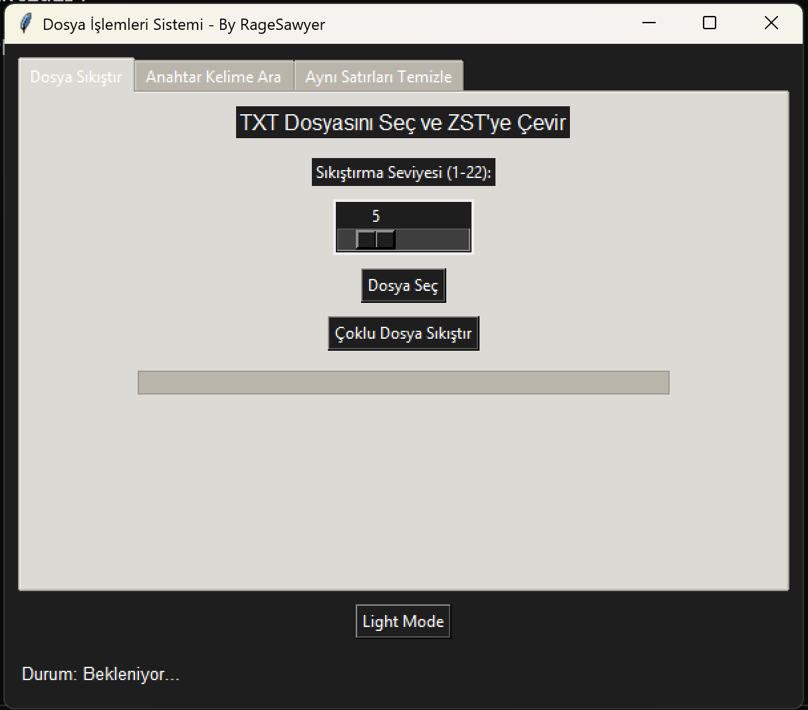
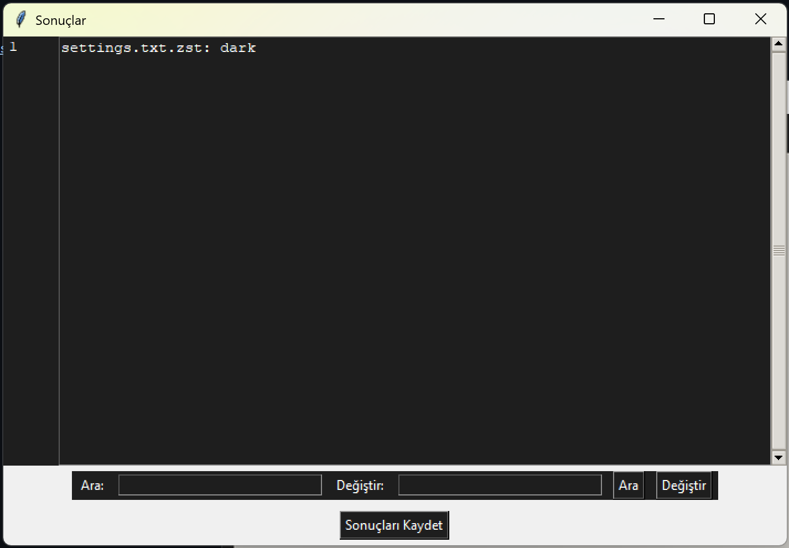

# Zstandard Sıkıştırıcı

Kullanıcı dostu ve verimli bir dosya sıkıştırma uygulaması. Python ile geliştirilmiştir. Aşağıda öne çıkan özellikleri listelenmiştir:

## Özellikler

- **TXT Sıkıştırma**: .txt dosyalarını ayarlanabilir sıkıştırma seviyeleri (1-22) ile sıkıştırma.
- **Anahtar Kelime Arama**: Sıkıştırılmış .zst dosyalarında hızlı anahtar kelime arama.
- **Tekrar Eden Satırların Kaldırılması**: Sıkıştırılmış dosyalarda tekrar eden satırları otomatik olarak belirleme ve kaldırma.
- **IDE Benzeri Arama Sistemi**: Satır numaraları, arama, değiştirme ve satır seçme özellikleriyle entegre bir arama arayüzü.

---

## Demonstrasyon

[Demo Videosunu İzle](https://youtu.be/4OWkSlusKfU)

---

## Kurulum ve Kullanım

1. Depoyu klonlayın:
   ```bash
   git clone <repository-url>
   cd <repository-folder>
   ```
2. Gerekli bağımlılıkları yükleyin:
   ```bash
   pip install -r requirements.txt
   ```
3. Uygulamayı çalıştırın:
   ```bash
   python app.py
   ```

## Ekran Görüntüleri

### Koyu Mod Arayüzü



### Arama ve Değiştirme



---

## Zstandard Sıkıştırıcı

Zstandard Sıkıştırıcı uygulaması, yüksek sıkıştırma oranlarını çok yönlü yönetim araçlarıyla birleştirerek sıkıştırılmış dosyaları verimli bir şekilde yönetmeniz için ideal bir çözüm sunar.

---

### English Translation

# Zstandard Compressor

A user-friendly and efficient file compression application built with Python. Below are its highlighted features:

## Features

- **TXT Compression**: Compress .txt files with adjustable compression levels (1-22).
- **Keyword Search in .zst Files**: Quickly search for keywords in compressed .zst files.
- **Duplicate Line Removal**: Automatically identify and remove duplicate lines in compressed files.
- **IDE-Like Search System**: Includes an integrated search interface with line numbers, search, replace, and line selection capabilities.

---

## Demonstration

[Watch the Demo Video](https://youtu.be/4OWkSlusKfU)

---

## Installation and Usage

1. Clone the repository:
   ```bash
   git clone <repository-url>
   cd <repository-folder>
   ```
2. Install required dependencies:
   ```bash
   pip install -r requirements.txt
   ```
3. Run the application:
   ```bash
   python app.py
   ```

## Screenshots

### Dark Mode Interface


### Search and Replace


---

The Zstandard Compressor application is your one-stop solution for managing compressed files efficiently, combining high compression rates with versatile management tools.
